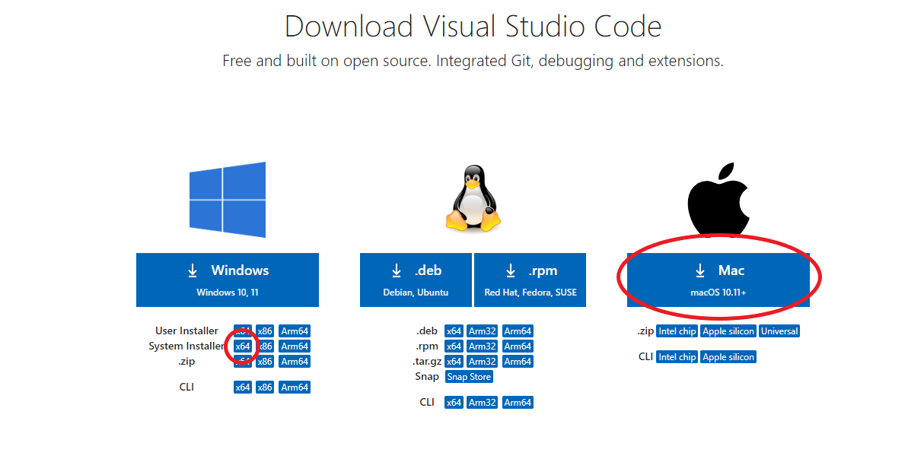

# Install Visual Studio Code

## 1. Introduction

In this challenge we will install and configure Visual Studio Code.

## 2. Challenge

1. Navigate to the <a href="https://code.visualstudio.com/download" target="_blank">download-page</a>
1. Download the right installer
   - Are you using Windows? Choose the System Installer x64.
   - Are you using macOS? Click the big `Download for Mac` button.

3. Execute the installer
   - Are you using Windows? Pay attention to the following settings:
     - Install Visual Studio Code in the suggested location
     - Let the installer add `Open with Code` to the context menu (both file and directory)
     - Let the installer add the program to the PATH
4. Let the installer finish and open VS Code to see if the installation was succesful

5. Working with markdown files in vscode.
   - Every challenge is presented as a _markdown_ file, e.g. _description.md_. A markdown file is a text file that uses markup syntax to add formatting and structure to the text. It is often used to create documentation. Throughout the challenges, we will be using markdown files to describe what needs to be completed. You can find a markdown file in each challenge folder. You can view the source code of the markdown file by opening the file. By selecting the preview button you can view the compiled document.
   - Open preview by default:
     - Since you'll be reading markdown files instead of writing them most of the time it might be useful to change the default behaviour to _preview mode_.
     - Go to Settings -> Workbench -> Editor Associations. Select "Add Item" and add the value `vscode.markdown.preview.editor` for item `*.md`.
     - Markdown files are now openend in preview instead of source code by default.
