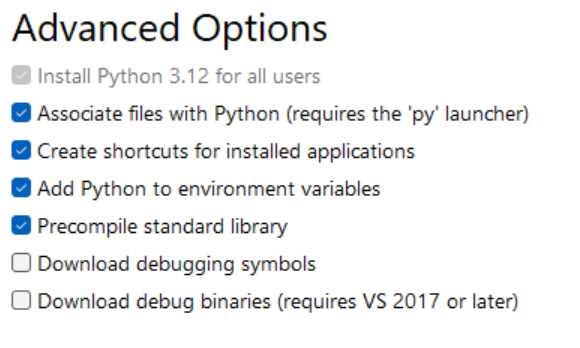

# Install Python and verify challenges

## 1. Prerequisites

- Visual Studio Code is installed.
- Git is installed.
- You have a GitHub account.
- You have accepted the GitHub Classroom assignment and cloned your challenges repository in a local folder.

## 2. Introduction

You have probably noticed that all challenges are described in de _description.md_ file. For most challenges, you will need to write your solution in a separate file called "solution.txt".
Each challenge also contains a _verify.py_ file. This file is a python script that is used to check if your solution is correct.
You can run this file yourself after finishing the challenge to verify your solution.

## 3. Challenge

### 3.1. Install Python

In order to run the verify scripts, you will need to have Python installed on your machine.
If you don't have Python installed yet, you can download it from the official website: [Python.org](https://www.python.org/downloads/).
Select "Custom installation" and make sure to check "Add Python to environment variables" in the advanced options:

<a href="./python.png" target="_blank">
    
</a>

### 3.2. Verifying challenges

Every challenge you submit will be checked by running the verify script. You can always run the verify script yourself to see if you have completed the challenge successfully.

You should always run the verify script from the directory it is defined in!

There are two ways to do this:

- Start `git bash` and navigate to the folder of the challenge you are working in with the command `cd`. Run the python script from the command line afterwards. Example assuming you are in de root folder of the challenges:

  ```bash
  > cd 02-git-challenges/01-git-basics
  > python verify.py
  ```

- Run the script from VS Code. This will run the script from the folder VS code is openened in. Most of the time this will be the wrong folder! You can circumvent this by changing the folder in the terminal after running the script using `cd` and then running the script again.
